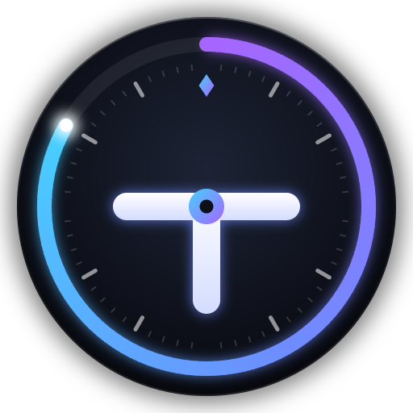
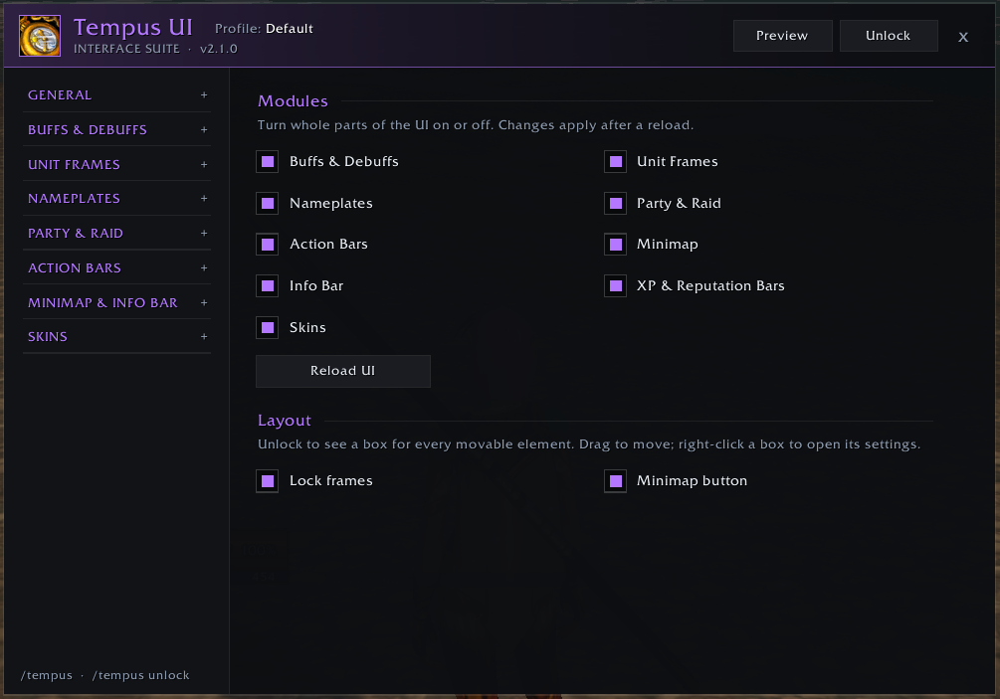
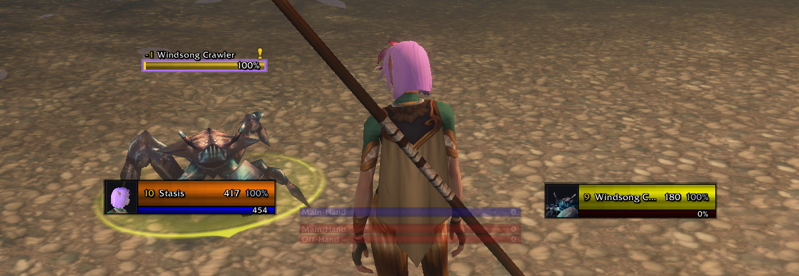
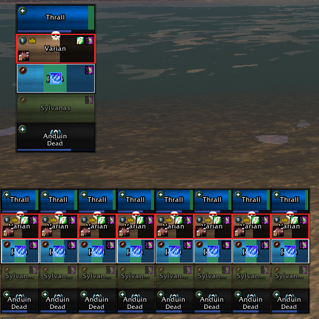
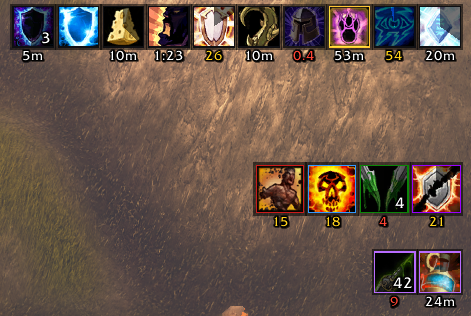
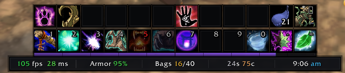
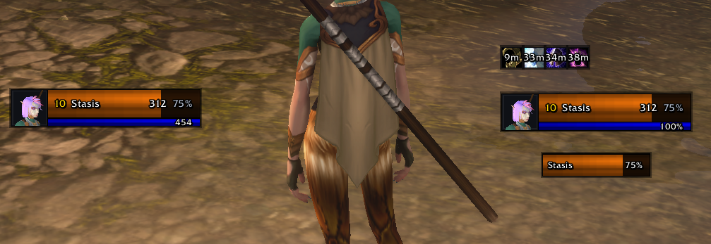

<h1 align="center">Tempus UI</h1>

A complete World of Warcraft interface in one clean look: buff timers, unit frames, nameplates, party and raid frames, action bars, a square minimap, an info bar, and skins for Blizzard's windows. Every part is a module you can turn off.

Built for the new Classic client (interface 16001), where the game hides health, auras and range from addons in combat. Tempus is written around that: hidden values go straight from the game into bars, text and colours, and auras are drawn by the game's own aura containers, so everything keeps updating mid-fight.

## Screenshots

| Nameplates | Party & raid frames |
|---|---|
|  |  |
| **Buffs & debuffs** | **Action bars & info bar** |
|  |  |
| **Unit frames** | |
|  | |

## Modules

- **Buffs & Debuffs**: icon or bar timers, a watch list for buffs you never want to forget, expiry warnings, click to recast or cancel.
- **Unit Frames**: player, target, target-of-target and pet, with cast bars, portraits, combo points and live target auras.
- **Nameplates**
  - Colours for threat (tank or damage role), execute range, class and reaction.
  - Con at a glance: a coloured strip, relative level (+3 / -2), elite pips or a 1-5 danger rating; grey mobs shrink and fade.
  - Cast bars that show when a cast can be interrupted, and alerts for spells on your watch list.
  - Your debuffs, purgeable buffs and crowd control.
- **Party & Raid**
  - Healer-ready frames: range fading, incoming heals and absorbs, and dispellable debuffs with a coloured tint.
  - Your HoTs with timers, role and leader icons, aggro borders, and a raid grid for up to 40.
  - Built-in click-casting with starting bindings for Druid, Priest, Shaman and Paladin; Clique also works.
- **Action Bars**: restyled bars with fading, hotkeys and range colouring.
- **Minimap, Info Bar, XP & Reputation Bars**: a square minimap and a configurable info bar.
- **Skins**: Blizzard windows, tooltips, chat, and Bagnon, DBM and Healium.

Every settings page has a live preview. Unlock the UI to drag any element into place; sample frames fill the boxes so you can arrange group frames while solo.

## Install

Copy the `Tempus` folder into `World of Warcraft/_classic_/Interface/AddOns/` (or the folder for your client), then log in. The first-run setup picks modules, UI scale and a layout preset.

## Commands

| Command | What it does |
|---|---|
| `/tempus` | Open settings |
| `/tempus unlock` / `lock` | Show / hide the boxes for dragging elements |
| `/tempus install` | Run the first-run setup again |
| `/tempus test` | Preview buff displays with sample auras |
| `/tempus safe` | Turn off everything except buffs and reload (escape hatch) |
| `/tempus debug` | Show aura status and the last error |
| `/tempus help` | List commands |

## Notes

- Tempus nameplates stay off while Plater or another nameplate addon is loaded.
- Settings are stored per profile in `TempusDB`.

## License

Copyright (c) 2026 Allison Bayless. All rights reserved. You're welcome to download and play with Tempus UI; copying, re-uploading or reusing its code or artwork needs permission. See [LICENSE](LICENSE).
